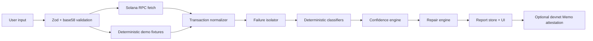

# SolFix

Solana transaction diagnostics.

SolFix helps users and developers understand why a Solana transaction failed. Paste a transaction signature, choose `mainnet-beta` or `devnet`, and the app retrieves RPC data, normalizes instructions and logs, isolates failure evidence, classifies known errors with deterministic rules, persists the analysis, and produces repair guidance.

Central principle:

```text
RPC facts -> deterministic rules -> optional explanatory text
```

## Core Features

- Next.js App Router, TypeScript strict mode, Tailwind CSS, Lucide UI.
- Live Solana RPC lookup through `@solana/web3.js`.
- Optional deterministic examples for local exploration.
- Instruction tree, inner instructions, logs, evidence inspector, confidence scoring, and repair recommendations.
- Shareable report routes backed by PostgreSQL in production, local JSON in development, or memory in tests.
- Devnet Memo attestation flow with browser wallet signing, confirmation, saved signature, and canonical report hashing.
- Safe serialized-transaction simulation API for base64 transactions.
- AI explanation provider abstraction with deterministic fallback plus OpenAI and Anthropic-compatible providers.
- Rate limiting, Zod validation, safe health response, and no private-key handling.

## Architecture



## Local Setup

```bash
npm install
npm run dev
```

Open `http://localhost:3000`.

Useful commands:

```bash
npm run lint
npm run typecheck
npm run test
npm run build
npm run check:env
```

On Windows PowerShell with script execution disabled, use `npm.cmd run <script>`.

## Environment Variables

Copy `.env.example` to `.env.local` and fill only what you need for local development.

- `PERSISTENCE_MODE`: `postgres`, `local-file`, or `memory`. Production must use `postgres`.
- `DATABASE_URL`: PostgreSQL connection string for production persistence.
- `SOLANA_MAINNET_RPC_URL`: Optional mainnet RPC override.
- `SOLANA_DEVNET_RPC_URL`: Optional devnet RPC override.
- `AI_PROVIDER`: Defaults to deterministic.
- `ENABLE_WALLET_ATTESTATION`: Set `false` to hide/disable attestation flows in a fuller UI.
- `ENABLE_CUSTOM_RPC`: Reserved for safely controlled custom RPC support.

## Database

`prisma/schema.prisma` defines report and attestation tables for PostgreSQL. Production must set `PERSISTENCE_MODE=postgres` and `DATABASE_URL`. Development may set `PERSISTENCE_MODE=local-file` to persist local reports to `.data/solfix-reports.json`. Tests use `PERSISTENCE_MODE=memory`.

```bash
npm run db:generate
npm run db:migrate
```

Use `npx prisma migrate deploy` for production migrations.

## Real RPC Mode

`POST /api/analyze` accepts:

```json
{
  "signature": "base58 transaction signature",
  "network": "devnet"
}
```

The server validates the signature, fetches the parsed transaction, and normalizes logs, instructions, balances, and status.

## Demo Mode

Use `/demo` or send:

```json
{
  "network": "devnet",
  "demoScenario": "insufficient-sol"
}
```

Demo signatures are clearly marked as non-real and never presented as blockchain facts.

## Memo Attestation

Reports are canonicalized with:

- report ID
- transaction signature
- network
- diagnosis category
- failing program ID
- failing instruction index
- confidence
- verification status
- created timestamp
- report version

The SHA-256 hash is compacted into:

```text
SOLFIX|v1|report:<reportId>|source:<shortSignature>|hash:<sha256>|ts:<unix>
```

`POST /api/attest/prepare` prepares a devnet Memo transaction for wallet approval. The report page can connect a browser wallet, request signature, send the devnet transaction, confirm it, and save the resulting signature through `POST /api/attest/submit`. The app never asks for private keys.

## Simulation

`POST /api/simulate` accepts a bounded base64 serialized transaction and a supported network:

```json
{
  "network": "devnet",
  "serializedTransaction": "...",
  "encoding": "base64"
}
```

The route deserializes a legacy or versioned transaction and calls Solana RPC simulation with signature verification disabled where supported.

## AI Providers

Core diagnosis does not require AI. Set `ENABLE_AI_EXPLANATIONS=true` and `AI_PROVIDER=openai` or `AI_PROVIDER=anthropic` to use provider-backed explanation text. Prompts include only the existing report evidence and instruct providers not to invent chain facts. If a provider fails validation, the deterministic explanation is retained.

## Security

- No private keys or seed phrases.
- No automatic repair execution.
- No generated HTML from logs or AI.
- Zod request validation.
- Network allowlist.
- Signature length/base58 validation.
- In-memory rate limiting.
- Safe health endpoint without secret disclosure.

## Limitations

- Arbitrary simulation is limited to bounded serialized transaction payloads; SolFix does not accept executable code or private signing material.
- AI explanations are optional and require provider credentials; deterministic diagnosis remains the source of truth.
- Wallet attestation depends on a browser wallet being available and connected to a devnet-capable account.
- Public RPC endpoints may rate-limit or omit old transaction history.

## Deployment

1. Create a Vercel project.
2. Create a Supabase PostgreSQL database.
3. Set `DATABASE_URL`, `NEXT_PUBLIC_APP_URL`, and RPC URLs in Vercel.
4. Run `npm run db:generate` and migrations in the deployment workflow.
5. Deploy with `npm run build`.
6. Confirm `/api/health` reports `ok`.

## 60-Second Demo Flow

1. Open `/` and show “Find the instruction that broke.”
2. Click “Load example.”
3. Show timeline: retrieved, decoded, isolated, classified, repair generated.
4. Point to root cause, failing instruction, program ID, logs, and confidence.
5. Show instruction tree, raw logs, and repair code.
6. Show the report slug and Memo payload.

## Important Paths

- `src/lib/analysis/orchestrator.ts`
- `src/lib/classifiers/index.ts`
- `src/data/demo-scenarios.ts`
- `src/components/analysis-view.tsx`
- `src/app/api/analyze/route.ts`
- `src/app/api/attest/prepare/route.ts`
- `prisma/schema.prisma`
